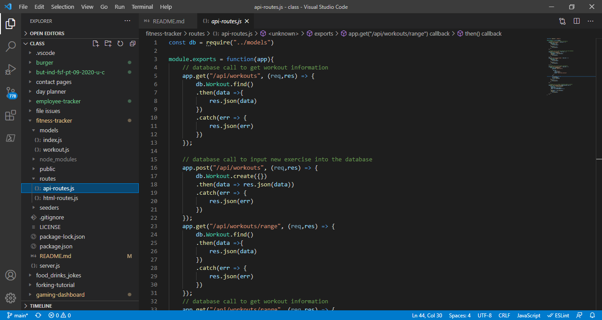
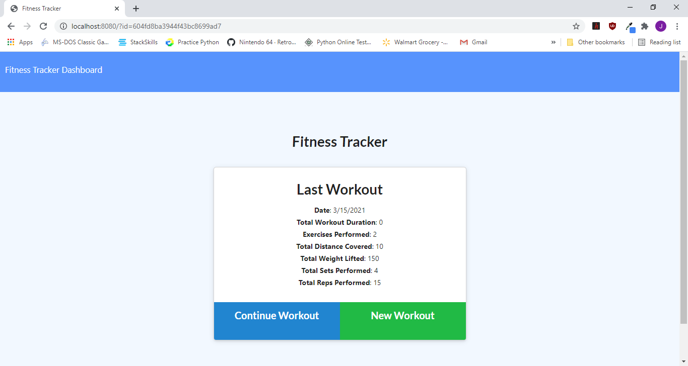

  
  # Fitness-Tracker
 
  ## Description
  This project focuses on the use of MongoDB to make a NO-SQL. With MongoDB the data is stored in an object form. With this project, a user can log their workout into the webpage and it will be stored in a MongoDB SQL. 
  
  ## Table of Contents
  - [Title](#Title)
  - [Description](#description)
  - [Table of Contents](#table-of-contents)
  - [Screenshots](#screenshots)
  - [Installation](#installation)
  - [Usage](#usage)
  - [Testing](#testing)
  - [Additional Information](#additional-information)
  - [License](#license)
  - [Contributing](#contributing)
  - [Questions and Feedback](#questions-and-feedback)

  ## Installation
   This project is deployed at: https://ancient-badlands-29219.herokuapp.com/

  ## Usage
  This project allows the user to track their fitness regimen and shows them how it compares to previous workouts.

  ## Technologies Used:
  MongoDB, Javasript, HTML, CSS, Express, Mongoose, and Morgan

  ## Code Sample:
  As shown below, the routes to gather information from the MongoDB with the find(), and create() to input information into the database.

  
  

  ## Screenshots
  

  ## License
  MIT License - see the [LICENSE.txt](https://github.com/tussingj89/Fitness-Tracker/blob/main/LICENSE.txt) file for details
  
  ## Testing 
  There are currently no tests available.

  ## Contributing
  When contributing to this repository, please first discuss the change you wish to make via issue, email, or any other method with the owners of this repository before making a change.
  
  ## Questions and Feedback
  Please contact me using one of the following:
  - Github: [tussingj89](https://gist.github.com/tussingj89)
  - Email: tussing40@gmail.com
